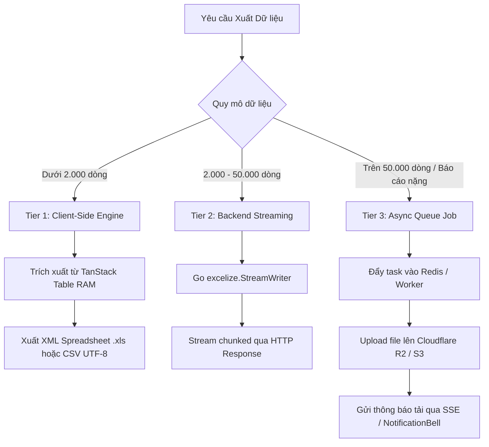

# Data Export Standard & Architecture Guide

Tài liệu quy chuẩn kiến trúc và hướng dẫn triển khai tính năng **Xuất Dữ Liệu (Excel & CSV Export)** cho toàn bộ hệ thống Monorepo Arda.

---

## 1. Ba Cấp Độ Kiến Trúc (3-Tier Export Architecture)



| Cấp độ | Quy mô áp dụng | Cơ chế xử lý | Trải nghiệm người dùng |
| :--- | :--- | :--- | :--- |
| **Tier 1: Client-Side** | $\le 2.000$ dòng, trang hiện tại, dòng đã chọn | Render Blob trực tiếp trên trình duyệt bằng `table-export.ts` | Tải xuống tức thì trong $< 1$ giây |
| **Tier 2: Backend Streaming** | $2.000 - 50.000$ dòng | Backend stream dữ liệu qua `excelize` O(1) RAM | Tải trực tiếp qua trình duyệt trong $2 - 5$ giây |
| **Tier 3: Async Queue Job** | $> 50.000$ dòng, báo cáo tài chính lớn | Worker xử lý nền, lưu R2/S3, bắn SSE notification | Toast nhận job $\rightarrow$ Thông báo chuông $\rightarrow$ Tải từ link S3 |

---

## 2. Hướng Dẫn Sử Dụng trên Frontend (`@workspace/admin-list`)

### 2.1. Sử dụng Mặc định với `ListTableToolbar`

Nút **"Xuất Excel"** trong `ListTableToolbar` đã được tự động tích hợp sẵn `TableExportDialog`. Không cần viết thêm code xử lý:

```tsx
import { ListTableToolbar } from "@workspace/admin-list/list-table-toolbar"

<ListTableToolbar
  table={table}
  onCreate={() => setCreateOpen(true)}
  createLabel={t("admin.users.create")}
  exportFilename="danh_sach_nguoi_dung"
  sheetName="Users"
/>
```

Khi người dùng click vào nút, hệ thống sẽ mở hộp thoại **`TableExportDialog`** cho phép:
1. **Chọn định dạng:** Excel Spreadsheet (`.xls`) hoặc CSV UTF-8 (`.csv`).
2. **Chọn phạm vi:** *Tất cả kết quả lọc* vs *Các dòng đang tick chọn* vs *Trang hiện tại*.
3. **Chọn cột dữ liệu:** Bật/tắt các cột cần xuất (mặc định lấy theo các cột đang hiển thị).

---

### 2.2. Xuất Trực Tiếp Dòng Đã Chọn qua `FloatingBatchActionBar`

Khi người dùng tick chọn các checkbox trên bảng, nút xuất hàng loạt có thể gọi trực tiếp hàm tiện ích `exportTableToExcelXml` hoặc `exportTableToCsv`:

```tsx
import { ListPageShell } from "@workspace/admin-list/list-page-shell"
import { exportTableToExcelXml } from "@workspace/admin-list/table-export"

<ListPageShell
  title={t("admin.users.title")}
  table={table}
  batchActions={(tbl) => (
    <Button
      size="sm"
      variant="outline"
      onClick={() => {
        exportTableToExcelXml({
          table: tbl,
          scope: "selected",
          filename: "users_selected",
          sheetName: "Selected Users",
        })
      }}
    >
      <Download className="mr-1.5 size-3.5" />
      Xuất Excel ({tbl.getSelectedRowModel().rows.length})
    </Button>
  )}
  // ...
/>
```

---

### 2.3. Tích Hợp API Xuất Phía Server (`onServerExport`)

Đối với các bảng có dữ liệu lớn cần server xử lý:

```tsx
<ListTableToolbar
  table={table}
  exportFilename="bao_cao_giao_dich"
  onServerExport={async ({ scope, format, columnIds }) => {
    await transactionApi.requestExport({
      scope,
      format,
      columns: columnIds,
      filter: activeFilters,
    })
    notify.info("Yêu cầu xuất file đã được tiếp nhận. Bạn sẽ nhận thông báo khi file sẵn sàng.")
  }}
/>
```

---

## 3. Tiêu Chuẩn Định Dạng File & Tiếng Việt (Encoding Invariants)

1. **Chuẩn CSV UTF-8:**
   - Mọi tệp CSV xuất ra từ `exportTableToCsv` đều được đính kèm **Byte Order Mark (BOM `\uFEFF`)** ở đầu tệp.
   - Giúp Microsoft Excel trên cả Windows và macOS tự động nhận diện bảng mã UTF-8, hiển thị tiếng Việt có dấu hoàn hảo mà không bị lỗi font (mojibake).
2. **Chuẩn Excel XML Spreadsheet:**
   - Sử dụng định dạng chuẩn Microsoft Office XML Spreadsheet (`application/vnd.ms-excel`).
   - Hỗ trợ phân định kiểu dữ liệu:
     - Số $\rightarrow$ `ss:Type="Number"` (cho phép người dùng áp dụng hàm `SUM`, `AVERAGE` ngay lập tức).
     - Ngày tháng / Chuỗi $\rightarrow$ `ss:Type="String"`.
   - Header được định dạng in đậm và bo viền chuyên nghiệp.

---

## 4. Quy Chuẩn Backend API (Go Backend Contract)

### 4.1. Synchronous Streaming Endpoint (Tier 2)

```http
GET /api/<domain>/export?format=xlsx&columns=code,name,amount&status=ACTIVE
```

**Nguyên tắc triển khai Go Backend:**
- Sử dụng thư viện `github.com/xuri/excelize/v2` kết hợp `file.NewStreamWriter()`.
- Ghi dữ liệu trực tiếp vào `http.ResponseWriter` để duy trì bộ nhớ $O(1)$.
- Header trả về:
  ```http
  Content-Type: application/vnd.openxmlformats-officedocument.spreadsheetml.sheet
  Content-Disposition: attachment; filename="export_2026-08-27.xlsx"
  Transfer-Encoding: chunked
  ```

### 4.2. Asynchronous Export Job (Tier 3)

```http
POST /api/exports
Content-Type: application/json

{
  "domain": "finance",
  "resource": "transactions",
  "format": "xlsx",
  "columns": ["id", "account_no", "amount", "created_at"],
  "filter": { "from_date": "2026-01-01", "to_date": "2026-12-31" }
}
```

**Luồng phản hồi:**
1. Server trả về `202 Accepted` kèm `jobId`.
2. Worker truy vấn DB theo batch $1.000$ rows, upload file nén lên `media-service` (Cloudflare R2/S3).
3. Đẩy thông báo qua `notification-service` $\rightarrow$ SSE đẩy về browser $\rightarrow$ User click nhận file tải về.
