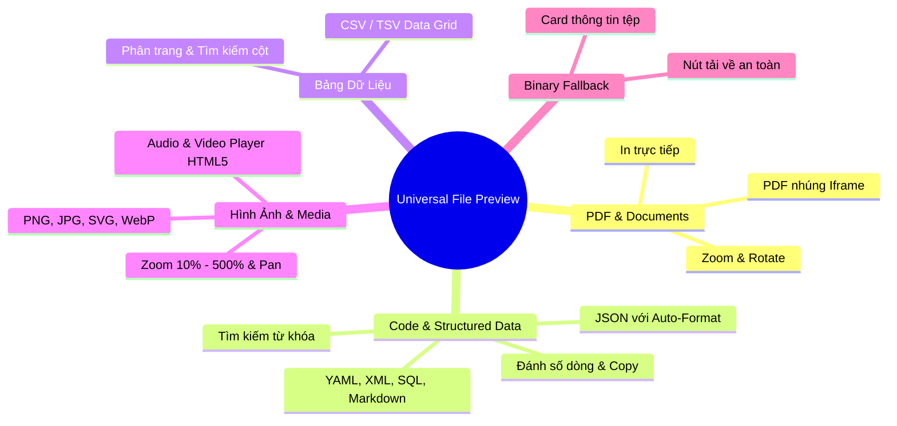

# Universal File Preview Standard & Architecture Guide

Tài liệu quy chuẩn kiến trúc và hướng dẫn sử dụng bộ thành phần **Xem Trước Tệp Đa Định Dạng (Universal File Preview)** cho toàn bộ hệ thống Monorepo Arda.

---

## 1. Tổng Quan & Các Định Dạng Hỗ Trợ

Bộ component `@workspace/ui/components/file-preview` hỗ trợ tự động nhận diện và render 100% Client-side cho các định dạng:



---

## 2. Hướng Dẫn Sử Dụng trên Frontend

### 2.1. Modal Toàn Màn Hình (`FilePreviewDialog`)

Sử dụng khi người dùng cần không gian rộng để xem chi tiết tệp, phóng to toàn màn hình:

```tsx
import { useState } from "react"
import { FilePreviewDialog, type FilePreviewSource } from "@workspace/ui/components/file-preview"
import { getMediaContentUrl } from "@workspace/media/urls"

export function MediaListPage() {
  const [previewSource, setPreviewSource] = useState<FilePreviewSource | null>(null)

  const handlePreview = (file: { id: string; name: string; size: number; mime: string }) => {
    setPreviewSource({
      src: getMediaContentUrl(file.id),
      filename: file.name,
      sizeBytes: file.size,
      mimeType: file.mime,
      title: `Xem trước: ${file.name}`,
    })
  }

  return (
    <div>
      {/* Nút bấm xem trước */}
      <button onClick={() => handlePreview(selectedFile)}>Xem trước</button>

      {/* Dialog Preview */}
      <FilePreviewDialog
        open={previewSource !== null}
        onOpenChange={(open) => !open && setPreviewSource(null)}
        source={previewSource}
      />
    </div>
  )
}
```

---

### 2.2. Bảng Trượt Phải (`FilePreviewDrawer` / Slide-over Sheet)

Chuẩn trải nghiệm Stripe/Linear: Vừa xem tài liệu đính kèm (hợp đồng KYC, hóa đơn) vừa thao tác duyệt hồ sơ bên dưới:

```tsx
import { useState } from "react"
import { FilePreviewDrawer, type FilePreviewSource } from "@workspace/ui/components/file-preview"

export function TransactionApprovalPage() {
  const [activeDocument, setActiveDocument] = useState<FilePreviewSource | null>(null)

  return (
    <div>
      <FilePreviewDrawer
        open={activeDocument !== null}
        onOpenChange={(open) => !open && setActiveDocument(null)}
        source={activeDocument}
        width="sm:max-w-2xl w-[90vw]"
      />
    </div>
  )
}
```

---

### 2.3. Xem Trực Tiếp Dữ Liệu Chuỗi trong Bộ Nhớ (In-Memory Content)

Không cần tải qua URL, có thể truyền trực tiếp nội dung string (ví dụ xem JSON cấu hình, XML template, log hệ thống):

```tsx
<FilePreviewDialog
  open={isOpen}
  onOpenChange={setIsOpen}
  source={{
    content: JSON.stringify(systemConfig, null, 2),
    filename: "config.json",
    mimeType: "application/json",
    title: "Cấu hình hệ thống",
  }}
/>
```

---

## 3. Các Tính Năng Cao Cấp Theo Từng Định Dạng

| Định dạng | Thành phần Renderer | Tính năng tương tác cao cấp |
| :--- | :--- | :--- |
| **JSON, YAML, XML, SQL, Markdown** | `CodeViewer` | • Đánh số dòng chính xác.<br>• Nút Format/Prettify tự động thụt lề cho JSON.<br>• Tìm kiếm từ khóa `Ctrl+F` kèm bộ đếm kết quả.<br>• Bật/tắt ngắt dòng (Word wrap) & Copy 1-click. |
| **CSV, TSV** | `CsvViewer` | • Tự động phân tích trường dữ liệu theo chuẩn RFC 4180.<br>• Hiển thị dạng bảng có phân trang ($50$ dòng/trang) và lọc tìm kiếm. |
| **PDF** | `PdfViewer` | • Nhúng iframe native với `#toolbar=1`.<br>• Nút in ấn trực tiếp, mở tab mới, tải về. |
| **Hình ảnh (PNG, JPG, SVG, WebP)** | `ImageViewer` | • Điều khiển Zoom ($10\% - 500\%$).<br>• Xoay góc $90^\circ$ theo chiều kim đồng hồ.<br>• Nền bàn cờ trong suốt (Checkered pattern) cho PNG/SVG. |
| **Video & Audio** | `MediaViewer` | • HTML5 native player với thanh tua và chỉnh âm lượng. |

---

## 4. Yêu Cầu Phía Backend (`media-service`)

1. **Header trả về:**
   - Khi gọi `GET /api/media/{public_id}`, Backend trả về header `Content-Disposition: inline` để trình duyệt nạp dữ liệu thay vì tự động tải file về máy.
   - Trả về đúng MIME `Content-Type` tương ứng với định dạng tệp.
2. **Bảo mật:**
   - Yêu cầu xác thực session qua cookie (`credentials: "include"`) để đảm bảo quyền truy cập tenant/organization.
