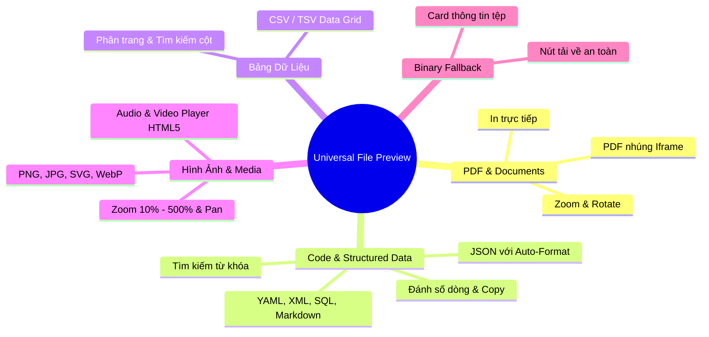

# Universal File Preview Standard & Architecture Guide

Tài liệu quy chuẩn kiến trúc và hướng dẫn sử dụng bộ thành phần **Xem Trước Tệp Đa Định Dạng (Universal File Preview)** cho toàn bộ hệ thống Monorepo Arda.

---

## 1. Tổng Quan & Các Định Dạng Hỗ Trợ

Bộ component `@workspace/ui/components/file-preview` hỗ trợ tự động nhận diện và render 100% Client-side cho các định dạng:



---

## 2. Hướng Dẫn Sử Dụng trên Frontend

### 2.1. Modal Toàn Màn Hình (`FilePreviewDialog`)

Sử dụng khi người dùng cần không gian rộng để xem chi tiết tệp, phóng to toàn màn hình:

```tsx
import { useState } from "react"
import {
  FilePreviewDialog,
  type FilePreviewSource,
} from "@workspace/ui/components/file-preview"
import { getMediaContentUrl } from "@workspace/media/urls"

export function MediaListPage() {
  const [previewSource, setPreviewSource] = useState<FilePreviewSource | null>(
    null
  )

  const handlePreview = (file: {
    id: string
    name: string
    size: number
    mime: string
  }) => {
    setPreviewSource({
      src: getMediaContentUrl(file.id),
      filename: file.name,
      sizeBytes: file.size,
      mimeType: file.mime,
      title: `Xem trước: ${file.name}`,
    })
  }

  return (
    <div>
      {/* Nút bấm xem trước */}
      <button onClick={() => handlePreview(selectedFile)}>Xem trước</button>

      {/* Dialog Preview */}
      <FilePreviewDialog
        open={previewSource !== null}
        onOpenChange={(open) => !open && setPreviewSource(null)}
        source={previewSource}
      />
    </div>
  )
}
```

---

### 2.2. Bảng Trượt Phải (`FilePreviewDrawer` / Slide-over Sheet)

Chuẩn trải nghiệm Stripe/Linear: Vừa xem tài liệu đính kèm (hợp đồng KYC, hóa đơn) vừa thao tác duyệt hồ sơ bên dưới:

```tsx
import { useState } from "react"
import {
  FilePreviewDrawer,
  type FilePreviewSource,
} from "@workspace/ui/components/file-preview"

export function TransactionApprovalPage() {
  const [activeDocument, setActiveDocument] =
    useState<FilePreviewSource | null>(null)

  return (
    <div>
      <FilePreviewDrawer
        open={activeDocument !== null}
        onOpenChange={(open) => !open && setActiveDocument(null)}
        source={activeDocument}
        width="sm:max-w-2xl w-[90vw]"
      />
    </div>
  )
}
```

---

### 2.3. Xem Trực Tiếp Dữ Liệu Chuỗi trong Bộ Nhớ (In-Memory Content)

Không cần tải qua URL, có thể truyền trực tiếp nội dung string (ví dụ xem JSON cấu hình, XML template, log hệ thống):

```tsx
<FilePreviewDialog
  open={isOpen}
  onOpenChange={setIsOpen}
  source={{
    content: JSON.stringify(systemConfig, null, 2),
    filename: "config.json",
    mimeType: "application/json",
    title: "Cấu hình hệ thống",
  }}
/>
```

---

## 3. Các Tính Năng Cao Cấp Theo Từng Định Dạng

| Định dạng                          | Thành phần Renderer | Tính năng tương tác cao cấp                                                                                                                                                        |
| :--------------------------------- | :------------------ | :--------------------------------------------------------------------------------------------------------------------------------------------------------------------------------- |
| **JSON, YAML, XML, SQL, Markdown** | `CodeViewer`        | • Đánh số dòng chính xác.<br>• Nút Format/Prettify tự động thụt lề cho JSON.<br>• Tìm kiếm từ khóa `Ctrl+F` kèm bộ đếm kết quả.<br>• Bật/tắt ngắt dòng (Word wrap) & Copy 1-click. |
| **CSV, TSV**                       | `CsvViewer`         | • Tự động phân tích trường dữ liệu theo chuẩn RFC 4180.<br>• Hiển thị dạng bảng có phân trang ($50$ dòng/trang) và lọc tìm kiếm.                                                   |
| **PDF**                            | `PdfViewer`         | • `pdfjs-dist` (lazy chunk, không vào boot bundle).<br>• Toolbar tự viết: chuyển trang, zoom, fit-width, xoay; in nằm ở header chung.                                            |
| **Hình ảnh (PNG, JPG, SVG, WebP)** | `ImageViewer`       | • Điều khiển Zoom ($10\% - 500\%$).<br>• Xoay góc $90^\circ$ theo chiều kim đồng hồ.<br>• Nền bàn cờ trong suốt (Checkered pattern) cho PNG/SVG.                                   |
| **Video & Audio**                  | `MediaViewer`       | • HTML5 native player với thanh tua và chỉnh âm lượng.                                                                                                                             |

### Phân tách trách nhiệm UI

- **Header của dialog/drawer** giữ toàn bộ hành động cấp tệp: Tải về, Mở tab mới,
  In (chỉ PDF), Toàn màn hình, Đóng. Không renderer nào tự lặp lại các nút này.
- **Renderer** chỉ giữ điều khiển nội dung: chuyển trang/zoom/xoay (PDF, ảnh),
  tìm kiếm/wrap/copy (code), phân trang (CSV).
- **Word (.doc/.docx)**: convert PDF qua Gotenberg rồi render bằng `PdfViewer`.
- **Excel (.xls/.xlsx)**: không xem inline — chỉ tải về (bảng rộng bị phân trang
  PDF đọc tệ hơn chính file gốc).

---

## 4. Yêu Cầu Phía Backend (`media-service`)

1. **Header trả về:**
   - Khi gọi `GET /api/media/{public_id}`, Backend trả về header `Content-Disposition: inline` để trình duyệt nạp dữ liệu thay vì tự động tải file về máy.
   - Trả về đúng MIME `Content-Type` tương ứng với định dạng tệp.
2. **Bảo mật:**
   - Yêu cầu xác thực session qua cookie (`credentials: "include"`) để đảm bảo quyền truy cập tenant/organization.

---

## 5. Bẫy: URL tệp riêng tư phải resolve qua API origin

Mọi `source.src` / nút xem / nút tải phải trỏ về `api.arda.io.vn` (dùng
`apiUrl()` hoặc `getPrivateMediaContentUrl()`), **không** truyền thẳng giá trị
`file_url` lưu trong DB:

- Upload từ deployment không phải `arda.io.vn` (preview Worker, dev harness)
  trả về đường dẫn tương đối `/api/media/<public_id>`. Mở nó trên web origin
  (`arda.io.vn`) sẽ đi qua shell Worker, cookie BFF (host-only trên
  `api.arda.io.vn`) không được gửi ⇒ `401 not_authenticated`.
- File private còn cần **org scope**: media-service từ chối request thiếu
  `X-Org-Id` bằng `tenant.error.scope_required`. Browser navigation
  (`window.open`, `<iframe src>`, ``) **không gắn được header này**, nên
  xem/tải file private phải fetch qua API client rồi dùng blob URL —
  `fetchMediaBlob()` + `downloadMediaFile()` trong `@workspace/media`.
- Quy ước: **lưu path tương đối** (portable giữa các môi trường), resolve lúc
  render bằng `apiUrl()`; chỉ thêm hậu tố `/download` khi cần
  `Content-Disposition: attachment`.
- File **≥ 2MB**: media-service trả 302 sang presigned URL của
  `storage_public_endpoint` (`s3.arda.io.vn`) và **auth-gateway chuyển tiếp 302
  cho browser** (không tự follow), nên browser tải trực tiếp từ storage.
  Endpoint này có CORS middleware Traefik
  (`arda-infra/platform/manifests/garage/garage-s3-cors-middleware.yaml`)
  để blob fetch theo redirect vẫn qua được kiểm tra credentialed CORS. Nếu
  `GARAGE_PUBLIC_ENDPOINT` trống, media-service tự stream thay vì redirect
  (`stream_max_size_mb`, mặc định 2MB).
  FE giới hạn preview inline 25MB (`MAX_INLINE_PREVIEW_BYTES`) và fallback sang
  điều hướng tải khi fetch blob lỗi mạng/CORS.
- Dùng hook chung `useBlobPreview()` (`@workspace/ui/components/file-preview`)
  để quản lý vòng đời object URL thay vì tự viết lại ở từng feature.
- `fetchMediaBlob()` nhận **cả** path tương đối (`/api/media/...`) lẫn URL tuyệt
  đối do `apiUrl()`/`getPrivateMedia*Url()` trả về ở production — `toMediaApiPath()`
  tự strip origin. Đừng truyền URL ngoài hệ thống (sẽ bị từ chối).
- **Word/Excel/PPT**: xem qua `GET /api/media/{public_id}/preview` — media-service
  convert sang PDF bằng **Gotenberg** (`GOTENBERG_URL`, pod nội bộ
  `gotenberg.platform.svc.cluster.local:3000`), cache PDF dẫn xuất tại
  `derived/{tenant_id}/{public_id}/v1.pdf` nên lần xem sau không convert lại.
  FE gọi `getPrivateMediaPreviewUrl()` với trạng thái `pending` (spinner trong
  dialog/drawer); convert lỗi hoặc file vượt `preview_max_size_mb` (mặc định
  25MB) thì rơi về file card + nút tải. `.jrxml` được nhận diện là XML code.
- Metadata thật (tên file, dung lượng, MIME) lấy theo lô bằng
  `getMediaMetadata(publicIds)` → `GET /api/media/files/metadata?public_ids=...`
  (tối đa 100 id/request, scope tenant+org). Nhờ đó list hiển thị đúng tên/dung
  lượng và chặn preview file lớn **trước khi** tải bytes.
- Mẫu tham chiếu: templates (`apps/platform/src/features/templates/`, unit test
  `apps/platform/tests/template-urls.test.ts`) và panel hồ sơ đính kèm
  (`packages/case-tabs/src/case-attachments-panel.tsx`).
